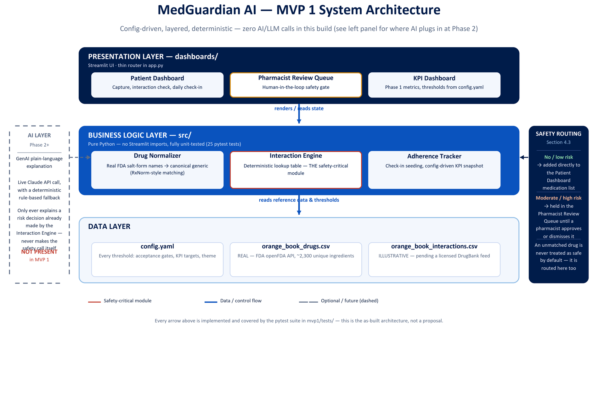

# Phase 7 — Prototype / MVP

Full specification: `../MVP1_Specification.docx`. This document summarizes what was actually built and verified.

## Scope Discipline

MVP 1 is scoped to exactly the P0 items in the RICE table (`Phase2_PM_Artifact_Pack.md`) — nothing more:

- Barcode/photo medication capture (simulated OCR, matched against real FDA drug data)
- A deterministic, rules-based interaction engine — **zero AI/LLM calls in the three core Phase 1 pages**
- Daily adherence check-in (per-drug, not a single day-level yes/no)
- A mandatory pharmacist review queue
- Single condition (Type 2 diabetes with cardiometabolic comorbidities), one language (English)

The caregiver dashboard, multilingual UX, personalized prediction, and EHR integration remain explicitly out of scope for MVP 1 — each is tagged with the phase it belongs to in `MVP1_Specification.docx`, Section 3. GenAI plain-language explanations (Section 2.1) are the one item pulled forward early, as an isolated, clearly-labeled opt-in preview — see "Phase 2 Preview" below.

## Architecture



Presentation/business-logic/data layers and the safety-routing branch (Section 4.3). The diagram's Phase 2 AI-layer panel is now partially realized: `src/ai_layer.py` and `dashboards/phase2_preview.py` implement an opt-in preview of it, isolated from the safety-critical path shown in the diagram.

```
mvp1/
├── config.yaml          Every product threshold — acceptance gates, KPI
│                         thresholds, adherence seeding, theme colors
├── src/                  Business logic — no Streamlit imports, fully testable
│   ├── config.py          Loads config.yaml; resolves data paths
│   ├── drug_normalizer.py  Real FDA data + RxNorm-style name matching
│   ├── interaction_engine.py  The safety-critical deterministic lookup
│   ├── fda_reference.py    Real openFDA label interaction text (reference only, not pairwise)
│   ├── state.py            Shared patient-state builder — first load and reset use the same path
│   ├── ai_layer.py         Opt-in Phase 2 preview — live Claude + deterministic fallback, isolated from the safety core
│   └── adherence.py       Demo patient, per-drug check-in seeding, config-driven KPIs
├── dashboards/            Thin UI layer
│   ├── app.py              Entry point / router
│   ├── theme.py             Shared Sandoz-blue styling
│   ├── patient_dashboard.py
│   ├── pharmacist_queue.py
│   ├── kpi_dashboard.py
│   └── phase2_preview.py    Walled-off Phase 2 chatbot page — not part of the Phase 1 pilot scope
└── tests/                 47 pytest tests, all passing
```

## Phase 2 Preview — An Isolated, Opt-In Exception

At the user's explicit request (after direct use surfaced the raw FDA label
text as unreadable), two Section 2.1 GenAI capabilities were added on top of
the Phase 1 core, deliberately isolated in `src/ai_layer.py` so nothing in
the safety-critical path (`interaction_engine.py`, `drug_normalizer.py`)
imports it:

1. **FDA label summarization** — the Patient Dashboard's FDA reference
   expander now shows a short table instead of a raw paragraph. Live by
   Claude when `ANTHROPIC_API_KEY` is set; a deterministic regex reformat
   of the label's own "Clinical Impact: / Intervention: / Examples:"
   structure otherwise (or plain sentence bullets if that structure isn't
   present) — never a fabricated summary.
2. **"Phase 2 Preview — Ask MedGuardian"** — a new, separate page
   (`dashboards/phase2_preview.py`) for general medication questions (e.g.
   food/drug interactions) the fixed Phase 1 table doesn't cover. Banner-
   labeled as out of the Phase 1 pilot scope; without a live key, it states
   that explicitly rather than simulating medical advice.

Both paths share `_call_llm()`, which returns `None` on any failure or
missing key so every caller has a safe, honest fallback. This keeps the
Phase 1 core's zero-AI claim intact for its three pages while still letting
the build demo where Phase 2 goes next.

## Patient Dashboard — Iterated Beyond the Initial Cut

After the initial build, direct use surfaced four gaps, each addressed without
expanding scope beyond Phase 1:

- **Medication removal + reset** — each medication card gained a "✕ Remove"
  button (which also drops any interaction alert naming that drug), plus a
  "🔄 Reset to demo defaults" button backed by `src/state.py` so first-load
  and reset build identical state instead of drifting apart.
- **Per-drug check-in** — the check-in flow previously logged one yes/no for
  the whole day; it now asks which *specific* medications were taken, stored
  as `{date: {drug: bool}}` in `adherence.py`.
- **Labeled adherence chart** — the 14-day chart now has explicit axis
  titles (Date / Adherence % of medications taken) instead of unlabeled bars.
- **Combination therapy / regimen view** — a new section shows the active
  medication combination as a table and stacked bar chart, grouped by an
  illustrative "role in regimen" tag (first-line vs. add-on) — explicitly
  labeled as reference-only, not clinical guidance, consistent with every
  other illustrative-data disclaimer in this build.

## What's Real vs. Illustrative

- **Medication identity is real** — `data/orange_book_drugs.csv`, ~56,000 records / ~2,300 unique active ingredients, fetched directly from the FDA's public openFDA Orange Book API.
- **Interaction pairs remain illustrative** — a production engine needs a licensed database (DrugBank) or openFDA's structured label/FAERS data.
- **Real FDA label text supplements the small pairwise table** — `openfda_interactions_fetcher.py` fetches actual "Drug Interactions" section text from openFDA's drug label API, cached to `data/openfda_interaction_warnings.csv`. Shown as pharmacist reference context (with source-label attribution) whenever a drug isn't in the pairwise table — real content instead of nothing, never mistaken for a pairwise match.
- **An unmatched medication is never silently treated as safe** — routed to the pharmacist queue instead. This is the literal code implementation of the Section 9 risk mitigation, and it's covered by its own test.

## Test Coverage

```
47 passed in 0.20s
```

| Test file | What it proves |
|---|---|
| `test_drug_normalizer.py` | Real salt-form name matching ("Amlodipine Besylate" → AMLODIPINE), case-insensitivity, and explicit guards against false-positive matches |
| `test_interaction_engine.py` | Known-pair detection, order-independence, multi-drug lists, and the safety guarantee that an unrecognized drug's rule is excluded rather than crashing |
| `test_adherence.py` | Deterministic per-drug check-in seeding, the daily/overall adherence aggregation helpers, and that KPI dashboard thresholds are genuinely read from `config.yaml`, not hardcoded strings that could drift from the proposal |
| `test_fda_reference.py` | Real FDA reference text parsing, salt-form prefix matching, and that rows with empty label text are skipped rather than shown as blank cards |
| `test_state.py` | The shared patient-state builder used at first load and on reset produces identical, reproducible state |
| `test_ai_layer.py` | The Phase 2 preview's deterministic fallback paths (table reformat, sentence bullets, chatbot's honest "no live model" message) — the only paths tested, since a live call needs network + a real key |

## Verified Manually (Browser)

- Medication search against the real 2,367-ingredient FDA list, with a live selection ("Warfarin Sodium") correctly normalizing to "Warfarin" and firing the high-risk interaction with the patient's existing ibuprofen
- The flagged item appearing correctly in the Pharmacist Review Queue with the right severity and explanation
- KPI Dashboard thresholds (≥85%, ≥70%, <5%, <2 hrs, and the 95%/60-day graduation gate) rendering exactly as specified in `config.yaml`
- Sidebar alert count updating correctly after a new flag is added

## Run It

```bash
cd mvp1
pip install -r requirements.txt
streamlit run dashboards/app.py
```

```bash
cd mvp1
pytest tests/ -v
```

See `04_Prototype_Readme_or_Link.md` for the pointer version of this section.
